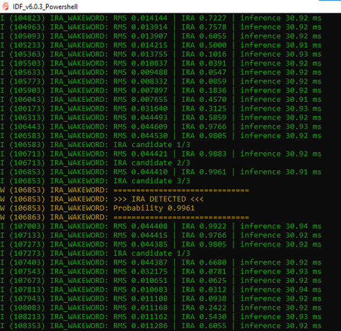

# IRA Wake-Word Project

## Hardware Status

**No measurement in this repository was taken on ESP32-S3 hardware.**

| Folder | Holds | Status |
|---|---|---|
| [`ira-wakeword/esp32/`](ira-wakeword/esp32/) | Boot self-test firmware, **no microphone** | Present, never compiled for Xtensa |
| [`ira-wakeword/esp32-live/`](ira-wakeword/esp32-live/) | Live firmware: I2S capture, continuous detection, smoothing | **Empty** -- to be copied in |
| [`ira-wakeword/results/`](ira-wakeword/results/) | Evidence measured on real hardware | First measurements recorded — see below |

**Hardware measurements are recorded in
[`ira-wakeword/results/HARDWARE_RESULTS.md`](ira-wakeword/results/HARDWARE_RESULTS.md).**
The first real measurements from live firmware are now recorded: inference time
30.9 ms, inference interval ~136 ms, 3-of-3 smoothing, confirmed detection at
probability 0.9961. Fields not yet measured (RAM, heap, arena) remain marked
*not yet recorded*.

Serial log from the live ESP32-S3 firmware:



Figures that are computed from source rather than measured -- model size,
configured arena size, static RAM totals -- are labelled as such wherever they
appear.

---

## Project Directory Structure
Below is an exhaustive index of the folders and their general purpose in this repository.

- **`cnn/`**: Contains the core Machine Learning pipelines.
  - Model definitions and training scripts (`train_cnn_v2*.py`).
  - Evaluation and scoring logic (`evaluate_*.py`).
  - TFLite Model conversion and quantization scripts (`convert_int8*.py`).
  - `models/`: Saved `.keras` and `.tflite` model files.
- **`esp32/`**: Microcontroller code for deployment on ESP32-S3 boards.
  - Contains the C++ inference logic, audio guarding, and the hand-written
    STFT feature frontend (`main/ira_features.cpp`) that is bit-identical to the
    training pipeline. It does **not** use `pymicro_features`.
  - `main/ira_model_data.cc`: The exported TFLite model as a C byte array.
- **`reports/`**: Documentation, audit logs, sensitivity reports, and evaluations in Markdown format.
- **`logs/`**: Outputs from training runs, including history CSVs, diagnostic JSONs, and evaluation spreadsheets.
- **`data-prep/`**: Python utilities for fetching, generating, and organizing the raw data.
  - Scripts for downloading external datasets (e.g., LibriSpeech).
  - Scripts for generating Text-to-Speech (TTS) samples.
  - Scripts for creating structured train/validation/test splits.
- **`audit/`**: Standalone scripts written to test, diagnose, and benchmark the trained models against hard negatives, varying SNRs, and streaming scenarios.
- **`tools/`**: Utility scripts (e.g., converting TFLite flatbuffers into C header files).
- **`dataset/`**: The compiled data artifacts. Contains the structured train/val/test splits, split manifests, and evaluation targets.
- **`synthetic/`, `real/`, `ambient/`, `negative/`, `ira words/`, `voices/`**: Raw audio staging directories containing the source audio files before they are grouped into formal dataset splits.
- **`piper-sample-generator/`**: Tooling used to generate the vast majority of synthetic positive text-to-speech samples.
- **`micro-wake-word/`**: Third-party library, used only by the retracted
  `audit/evaluate.py`. Its `pymicro_features` MicroFrontend is **not** used by
  training or by the device, and must not be used to evaluate this model.
- **`esp32-live/`**: Reserved for the live capture firmware (I2S microphone, continuous detection, smoothing). Currently empty.
- **`results/`**: Evidence measured on real ESP32-S3 hardware, with screenshots. Currently empty; see `results/HARDWARE_RESULTS.md`.
- **`build/`**: Compiled binaries and executables for local or host testing (e.g., `host_selftest.exe`).

---

## Model Training Iterations & History
The project has progressed through several model iterations (V1 through V2.8) to experiment with different augmentation strategies, learning rates, and dataset splits. Below is a comprehensive summary of all model versions:

| Version | Script | Description & Key Changes |
|---------|--------|---------------------------|
| **V1** | `train_cnn.py` | Base lightweight CNN. Fixed 1s window, pure CNN, original dataset. No dynamic background augmentation. |
| **V2** | `train_cnn_v2.py` | Introduced dynamic background augmentation and hard negatives. |
| **V2.1** | `train_cnn_v2_1.py` | Controlled experiment for stronger speech-negative discrimination. Negative batch composition changed to 60% ordinary speech, 20% ambient, 5% other, 15% hard-speech (V2 score >= 0.30). V1 streaming hard negatives excluded. |
| **V2.2** | `train_cnn_v2_2.py` | Controlled experiment: Moderate speech-negative curriculum. |
| **V2.3** | `train_cnn_v2_3.py` | **Primary Production Candidate**. Expanded negative dataset with verified TRAIN-only speech pools. Batch recipe: 32 pos + 14 easy speech + 7 medium speech + 4 hard speech + 5 ambient + 2 other. |
| **V2.4** | `train_cnn_v2_4.py` | Controlled LR-schedule experiment. Changed Learning Rate to `ReduceLROnPlateau`. |
| **V2.5** | `train_cnn_v2_5.py` | Controlled Positive Augmentation Experiment. Changed positive background mix to 75% ambient / 25% speech (instead of 50/50). |
| **V2.6** | `train_cnn_v2_6.py` | Controlled Positive Augmentation SNR Experiment. Constrained speech-background SNR to [+10 dB, +25 dB]. |
| **V2.7** | `train_cnn_v2_7.py` | Minimal hard-speech negative pressure. Changed negative half by one slot: 13 easy / 7 medium / 5 hard (was 4) / 5 ambient / 2 other. |
| **V2.8** | `train_cnn_v2_8.py` | Modified the hard lower bound for SNR from -5 dB to -10 dB. |

---

## Third-Party Assets

### Piper TTS voice models

Five **Piper TTS voice models** were used to generate the synthetic positive
training samples, which make up ~93% of all positives in the dataset. They are
third-party artifacts, not project source, and are untracked via `.gitignore`
(they total ~301 MB). The files remain on disk for contributors who already
have them.

| Voice | Size | Source |
|---|---|---|
| `en_US-amy-medium` | 60.27 MB | [download](https://huggingface.co/rhasspy/piper-voices/tree/main/en/en_US/amy/medium) |
| `en_US-hfc_female-medium` | 60.27 MB | [download](https://huggingface.co/rhasspy/piper-voices/tree/main/en/en_US/hfc_female/medium) |
| `en_US-hfc_male-medium` | 60.27 MB | [download](https://huggingface.co/rhasspy/piper-voices/tree/main/en/en_US/hfc_male/medium) |
| `en_US-lessac-medium` | 60.27 MB | [download](https://huggingface.co/rhasspy/piper-voices/tree/main/en/en_US/lessac/medium) |
| `en_US-ryan-medium` | 60.27 MB | [download](https://huggingface.co/rhasspy/piper-voices/tree/main/en/en_US/ryan/medium) |

Each voice is two files: `<name>.onnx` (the model) and `<name>.onnx.json`
(its config). Both are required.

Restore them into `ira-wakeword/voices/`:

```bash
cd ira-wakeword/voices
for v in amy hfc_female hfc_male lessac ryan; do
  curl -LO "https://huggingface.co/rhasspy/piper-voices/resolve/main/en/en_US/$v/medium/en_US-$v-medium.onnx"
  curl -LO "https://huggingface.co/rhasspy/piper-voices/resolve/main/en/en_US/$v/medium/en_US-$v-medium.onnx.json"
done
```

A copy of `en_US-lessac-medium.onnx` also sits at `ira-wakeword/` and is
likewise untracked.

Piper itself is MIT-licensed; the voice models carry their own terms -- see the
[Piper voices repository](https://huggingface.co/rhasspy/piper-voices) for
details.

---

## Model Architecture

The model is a **plain CNN**, not a DS-CNN. `build_model()` in
`cnn/train_cnn_v2_3.py` uses three dense `Conv2D` layers (8 / 16 / 32, 3x3) with
MaxPooling, then GlobalAveragePooling -> Dense(16) -> Dense(1, sigmoid).
There are no `SeparableConv2D` or `DepthwiseConv2D` layers anywhere in the
definition.

Frozen V2.3 INT8 model: `cnn/models/ira_cnn_v2_3_int8.tflite`, **13,312 bytes
(13.0 KB)**.

---

## Feature Pipeline — Training and Device Are Bit-Identical

Both the training pipeline and the on-device frontend use the same frozen
contract:

| step | value |
|---|---|
| Window | 16000 mono samples @ 16 kHz |
| STFT | `frame_length=480`, `frame_step=320`, `fft_length=512`, `pad_end=false` |
| Window fn | periodic Hann |
| Frames x bins | 49 x 40 (first 40 of the 257 rfft bins) |
| Compression | `log(|X| + 1e-6)`, natural log |
| Normalise | global z-score over all 1960 values, population std |
| Quantise | `clamp(rint(v / 0.06078097224235535) + 49, -128, 127)` |

This is **not** MFCC, mel, or the TFLM MicroFrontend.

Parity is verified, not assumed. `tools/test_feature_parity.py` compares the
Python training frontend against the C++ device frontend
(`esp32/main/ira_features.cpp`) and reports **0 INT8 mismatches out of 1960
values** on real audio — the two paths are bit-identical.

---

## Evaluation Status

### Retracted: earlier TPR and FAPH figures

An earlier version of this README quoted **TPR ~65.5%** and **FAPH ~511-864/hr**,
attributing the poor numbers to a "feature extraction mismatch between training
and inference."

**Those figures are retracted, and that explanation was wrong.**

They were produced by `audit/evaluate.py`, a stock `micro_wake_word` harness that
extracts features with `pymicro_features.MicroFrontend` (mel filterbank + PCAN,
10 ms stride -> 98 frames). The model was never trained on those features. The
script fed the network an out-of-distribution representation — measured mean
absolute difference **0.64-0.76** against the correct frontend, with a Pearson
correlation of only **+0.30 to +0.55**, and the wrong input shape (98 frames
instead of 49).

The mismatch was between the training pipeline and *that one evaluation script* —
never between training and the device.

See **`reports/CORRECTED_EVALUATION_REPORT.md`** for the full retraction.

### Current baseline

`reports/CORRECTED_EVALUATION_REPORT.md` re-evaluated using the correct frontend
on the held-out test split (1,003 positive + 772 negative clips), reporting
100.000% TPR and 0.389% FPR at threshold 0.50.

**Read that number with care.** It is measured on the in-distribution test split,
which is ~93% synthetic Piper TTS, and it evaluates `ira_cnn_int8.tflite` — an
earlier model with different quantization constants (scale 0.08363020,
zero-point -105) than frozen V2.3 (scale 0.06078097224235535, zero-point 49). It
is **not** a real-world number and should not be quoted as one.

### Not yet measured

The device does not run at threshold 0.50 per clip. It runs **threshold 0.95 with
3 consecutive detections required**, streaming over continuous audio. No
evaluation at that deployed configuration exists yet. Until one does, this
project has **no validated real-world TPR or false-accepts-per-hour figure.**

### Known limitations

1. **Dataset composition**: ~93% of positive samples are synthetic (Piper TTS);
   only ~7% are real human voices, **all from a single speaker**. Any TPR
   measured on real recordings from that same speaker is optimistic and must be
   reported as such.
2. **Augmentation**: V1 models trained without meaningful augmentation and are
   fragile in noise. V2 models introduce noise mixing and SNR curricula.

---

Please see the `reports/` folder for deeper dives, particularly `MODEL_AUDIT.md` and the various streaming evaluation reports.
